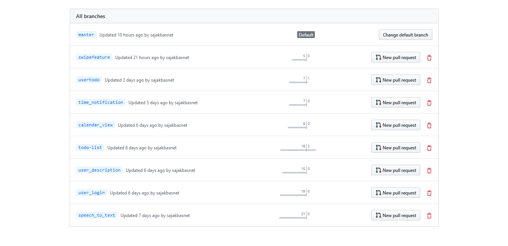

# Todo-Application
 It is an application for the user where the user can register themselves and login in the application add their todo according to the priority and date and set notification for the date and time when they need to be reminded. 
 
 

 
## Installation

### <b>1.Register User </b>

<i> - User should enter their username, email-address, and password for the registration.</i>

### <b>2.User Login </b>

<i> - User should enter their username and password for Login.</i>

### <b>3.Todo-list </b>

<i> - User will be able to see all the list after login and can add their todo by clicking in the floating Add icon button.</i>

### <b>4.Edit Todo </b>

<i> - User will be able to edit the todo by clicking on the Todo item.</i>

### <b>5.Delete Todo </b>

<i> - User will be able to delete the todo by swiping left or right from the list</i>

### <b>6.Todo by Priority </b>

<i> - User will be able to view todo item according to prioirty</i>

### Clone
- Clone this repo to your local machine using 'https://github.com/sajakbasnet/todo/'

## Architecture Design (MVVM)

## <B>MODEL</B>
### 1. Adapter
- pageAdapter
- TaskAdapter

### 2. Database
- AppDatabase
- DateConverter
- TaskDao
- TasEntry
- User
- UserDao
- UserDatabase

## <B>VIEW</B>
### 1. Activity
- MainActivity
- HomeActivity
- RegisterActivity
- AddEditTaskActivity

### 2. Fragments
- HomeFragment
- ListFragment
- UserFragment
- priority1fragment
- priority2fragment
- priority3fragment

## <B>VIEW MODEL</B>
- TaskActivityVieModel
- AddEditTaskViewModel
- TaskActivityVieModelp1
- TaskActivityVieModelp2
- TaskActivityVieModelp3

## Features
- user login
- user description
- swipe feature
- calendar view
- time notification
- speech to text

## Application Developemt 
- Master
- user_login branch
- user_description branch
- todo-list branch
- speech_to_text branch
- calendar_view brnach
- time_notification branch
- swipefeature branch

## References for the project

All list of modules that has been used for completion of this project

<i>1. Defining data using Room entities : 'https://developer.android.com/training/data-storage/room/defining-data'</i>

<i>2. Entity : 'https://developer.android.com/reference/android/arch/persistence/room/Entity'</i>

<i>3. Accessing data using Room DAOs : 'https://developer.android.com/training/data-storage/room/accessing-data'</i>

<i>4. Database : 'https://developer.android.com/reference/android/arch/persistence/room/Database'</i>

<i>5. Write and View Logs with Logcat : 'https://developer.android.com/studio/debug/am-logcat'</i>

<i>6. Menus : 'https://developer.android.com/guide/topics/ui/menus'</i>

<i>7. Android: Navigation Drawer : 'https://medium.com/quick-code/android-navigation-drawer-e80f7fc2594f'</i>

<i>8. Create views into a database : 'https://developer.android.com/training/data-storage/room/creating-views'</i>

<i>9. Query : 'https://developer.android.com/reference/android/arch/persistence/room/Query'</i>

<i>10. Pass data between fragments : 'https://developer.android.com/training/basics/fragments/pass-data-between'</i>

<i>11. Calendar.Builder : 'https://developer.android.com/reference/java/util/Calendar.Builder'</i>

<i>12. Android Speech to Text Tutorial : 'https://www.simplifiedcoding.net/android-speech-to-text-tutorial/'</i>

<i>13. Widget : 'https://developer.android.com/reference/android/support/v7/widget/package-summary' </i>

## Documentation 

### MVVM architecture
MVVM is one of the architectural patterns which enhances separation of concerns, it allows separating the user interface logic from the business (or the back-end) logic. Its target (with other MVC patterns goal) is to achieve the following principle “Keeping UI code simple and free of app logic in order to make it easier to manage”.

MVVM has mainly the following layers:
#### 1. Model

Model represents the data and business logic of the app. One of the recommended implementation strategies of this layer, is to expose its data through observables to be decoupled completely from ViewModel or any other observer/consumer (This will be illustrated in our MVVM sample app below).

#### 2. ViewModel

ViewModel interacts with model and also prepares observable(s) that can be observed by a View. ViewModel can optionally provide hooks for the view to pass events to the model.
One of the important implementation strategies of this layer is to decouple it from the View, i.e, ViewModel should not be aware about the view who is interacting with.

#### 3. View

Finally, the view role in this pattern is to observe (or subscribe to) a ViewModel observable to get data in order to update UI elements accordingly.
  

## License

- **[MIT license](http://opensource.org/licenses/mit-license.php)**
