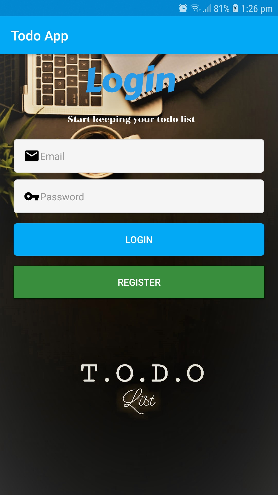
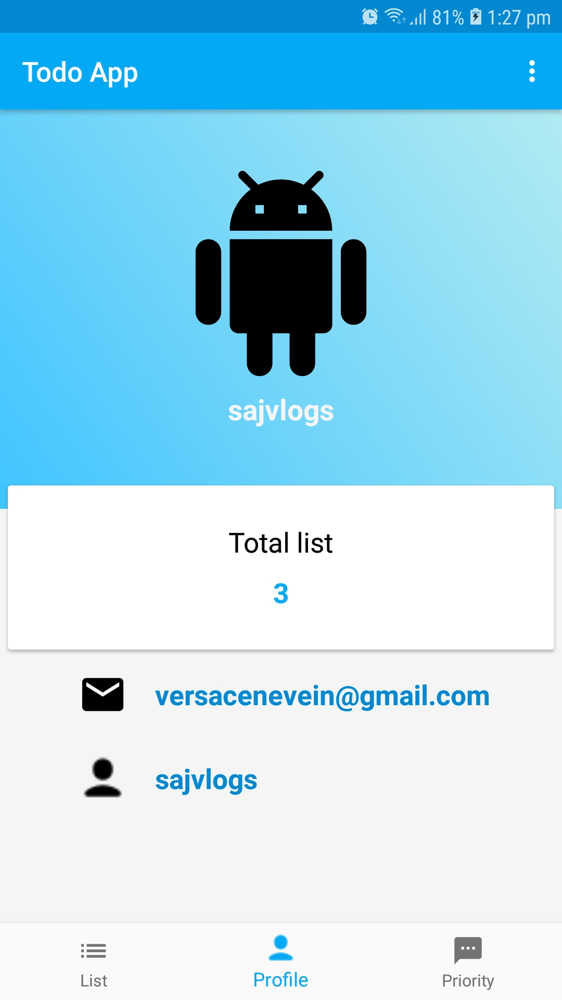
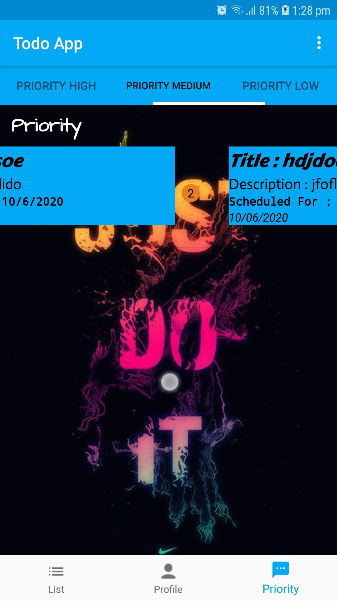
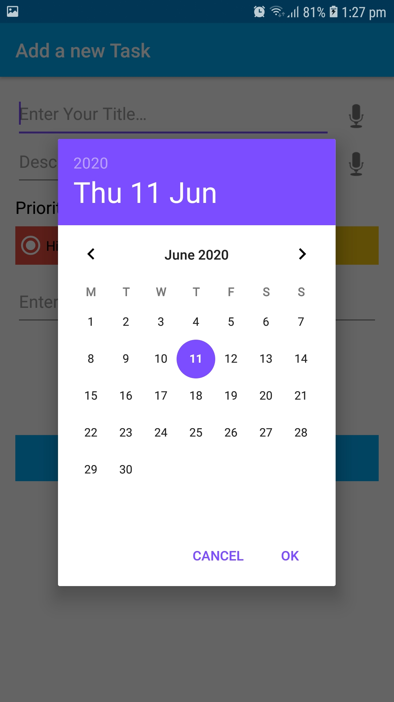
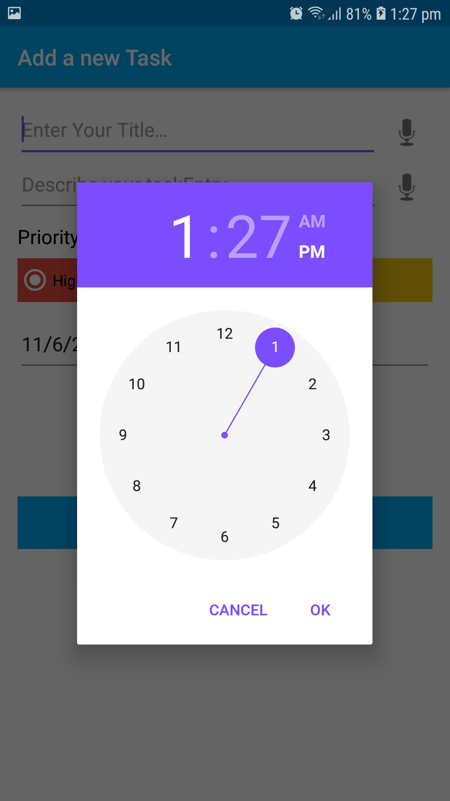
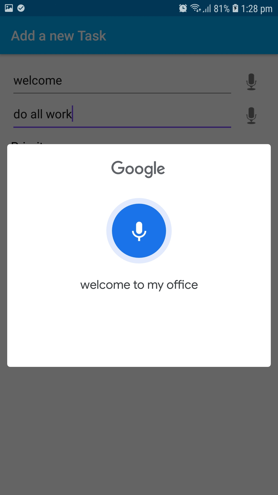
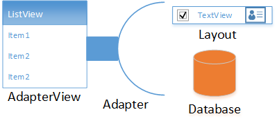

# Todo-Application
 It is an application for the user where the user can register themselves and login in the application add their todo according to the priority and date and set notification for the date and time when they need to be reminded. 
 
 

 
## Installation

### <b>1.Register User </b>

<i> - User should enter their username, email-address, and password for the registration.</i>

### <b>2.User Login </b>

<i> - User should enter their username and password for Login.</i>

### <b>3.Todo-list </b>

<i> - User will be able to see all the list after login and can add their todo by clicking in the floating Add icon button.</i>

### <b>4.Edit Todo </b>

<i> - User will be able to edit the todo by clicking on the Todo item.</i>

### <b>5.Delete Todo </b>

<i> - User will be able to delete the todo by swiping left or right from the list</i>

### <b>6.Todo by Priority </b>

<i> - User will be able to view todo item according to prioirty</i>

### Clone
- Clone this repo to your local machine using 'https://github.com/sajakbasnet/todo/'

## Architecture Design (MVVM)

## <B>MODEL</B>
### 1. Adapter
- pageAdapter
- TaskAdapter

### 2. Database
- AppDatabase
- DateConverter
- TaskDao
- TasEntry
- User
- UserDao
- UserDatabase

## <B>VIEW</B>
### 1. Activity
- MainActivity
- HomeActivity
- RegisterActivity
- AddEditTaskActivity

### 2. Fragments
- HomeFragment
- ListFragment
- UserFragment
- priority1fragment
- priority2fragment
- priority3fragment

## <B>VIEW MODEL</B>
- TaskActivityVieModel
- AddEditTaskViewModel
- TaskActivityVieModelp1
- TaskActivityVieModelp2
- TaskActivityVieModelp3

## Features

- user login

Login         |  Register                     |
:----------------------------:|:--------------------------------------:|
  |          

- user description

Description       |                      
:----------------------------:|
  |  

- swipe feature

Swipe      |                      
:----------------------------:|
  | 

- calendar view

Calendar     |                      
:----------------------------:|
  | 

- time notification

Time Set        |  Notification                   |
:----------------------------:|:--------------------------------------:|
  |     

- speech to text

Speech        |  To Text                  |
:----------------------------:|:--------------------------------------:|
  |     

## Application Developemt 
- Master
- user_login branch
- user_description branch
- todo-list branch
- speech_to_text branch
- calendar_view brnach
- time_notification branch
- swipefeature branch

## Documentation 

### MVVM architecture
MVVM is one of the architectural patterns which enhances separation of concerns, it allows separating the user interface logic from the business (or the back-end) logic. Its target (with other MVC patterns goal) is to achieve the following principle “Keeping UI code simple and free of app logic in order to make it easier to manage”.

MVVM has mainly the following layers:
#### 1. Model

Model represents the data and business logic of the app. One of the recommended implementation strategies of this layer, is to expose its data through observables to be decoupled completely from ViewModel or any other observer/consumer (This will be illustrated in our MVVM sample app below).

#### 2. ViewModel

ViewModel interacts with model and also prepares observable(s) that can be observed by a View. ViewModel can optionally provide hooks for the view to pass events to the model.
One of the important implementation strategies of this layer is to decouple it from the View, i.e, ViewModel should not be aware about the view who is interacting with.

#### 3. View

Finally, the view role in this pattern is to observe (or subscribe to) a ViewModel observable to get data in order to update UI elements accordingly.
  

### Architechture

#### 1. Activity
An activity is a single, focused thing that the user can do. Almost all activities interact with the user, so the Activity class takes care of creating a window for you in which you can place your UI with setContentView(View). While activities are often presented to the user as full-screen windows, they can also be used in other ways: as floating windows (via a theme with R.attr.windowIsFloating set), Multi-Window mode or embedded into other windows. There are two methods almost all subclasses of Activity will implement: 

 - onCreate(Bundle) is where you initialize your activity. Most importantly, here you will usually call setContentView(int) with a layout resource defining your UI, and using findViewById(int) to retrieve the widgets in that UI that you need to interact with programmatically. 
 
 - onPause() is where you deal with the user pausing active interaction with the activity. Any changes made by the user should at this point be committed (usually to the ContentProvider holding the data). In this state the activity is still visible on screen. 

Fig: StatePaths of an Activity

#### 2. Fragment
A Fragment represents a behavior or a portion of user interface in a FragmentActivity. You can combine multiple fragments in a single activity to build a multi-pane UI and reuse a fragment in multiple activities. You can think of a fragment as a modular section of an activity, which has its own lifecycle, receives its own input events, and which you can add or remove while the activity is running (sort of like a "sub activity" that you can reuse in different activities).

A fragment must always be hosted in an activity and the fragment's lifecycle is directly affected by the host activity's lifecycle. For example, when the activity is paused, so are all fragments in it, and when the activity is destroyed, so are all fragments. However, while an activity is running (it is in the resumed lifecycle state), you can manipulate each fragment independently, such as add or remove them. When you perform such a fragment transaction, you can also add it to a back stack that's managed by the activity—each back stack entry in the activity is a record of the fragment transaction that occurred. The back stack allows the user to reverse a fragment transaction (navigate backwards), by pressing the Back button.

#### 3. Adapter
Android’s Adapter is described in the API documentation, as “a bridge between an AdapterView and the underlying data for that view” .  An AdapterView is a group of widgets (aka view) components in Android that include the ListView, Spinner, and GridView.  In general, these are the widgets that provide the selecting capability in the user interface .  What is not mentioned in the documentation is that the AdapterView also provides the layout of the underlying data for the view.  The AdapterView really brings together the data and the layout (potentially in a complex collection of views) for each of the rows that make up the AdapterView.

#### 4. DAO(Data Access Object)
 Data Access Objects are the main classes where you define your database interactions. They can include a variety of query methods.

The class marked with @Dao should either be an interface or an abstract class. At compile time, Room will generate an implementation of this class when it is referenced by a Database.

An abstract @Dao class can optionally have a constructor that takes a Database as its only parameter.

It is recommended to have multiple Dao classes in your codebase depending on the tables they touch.

#### 5. ROOM
The Room persistence library provides an abstraction layer over SQLite to allow for more robust database access while harnessing the full power of SQLite.

The library helps you create a cache of your app's data on a device that's running your app. This cache, which serves as your app's single source of truth, allows users to view a consistent copy of key information within your app, regardless of whether users have an internet connection.

To use Room in your app, add the following dependencies to your app's build.gradle file:

## References for the project

All list of modules that has been used for completion of this project

<i>1. Defining data using Room entities : 'https://developer.android.com/training/data-storage/room/defining-data'</i>

<i>2. Entity : 'https://developer.android.com/reference/android/arch/persistence/room/Entity'</i>

<i>3. Accessing data using Room DAOs : 'https://developer.android.com/training/data-storage/room/accessing-data'</i>

<i>4. Database : 'https://developer.android.com/reference/android/arch/persistence/room/Database'</i>

<i>5. Write and View Logs with Logcat : 'https://developer.android.com/studio/debug/am-logcat'</i>

<i>6. Menus : 'https://developer.android.com/guide/topics/ui/menus'</i>

<i>7. Android: Navigation Drawer : 'https://medium.com/quick-code/android-navigation-drawer-e80f7fc2594f'</i>

<i>8. Create views into a database : 'https://developer.android.com/training/data-storage/room/creating-views'</i>

<i>9. Query : 'https://developer.android.com/reference/android/arch/persistence/room/Query'</i>

<i>10. Pass data between fragments : 'https://developer.android.com/training/basics/fragments/pass-data-between'</i>

<i>11. Calendar.Builder : 'https://developer.android.com/reference/java/util/Calendar.Builder'</i>

<i>12. Android Speech to Text Tutorial : 'https://www.simplifiedcoding.net/android-speech-to-text-tutorial/'</i>

<i>13. Widget : 'https://developer.android.com/reference/android/support/v7/widget/package-summary' </i>

<i>14. Android Adapters (and AdapterViews) : 'https://www.intertech.com/Blog/android-adapters-adapterviews/' </i>

<i>15. MVVM architecture : 'https://proandroiddev.com/mvvm-architecture-viewmodel-and-livedata-part-1-604f50cda1' </i>

## License

  

- **[MIT license](http://opensource.org/licenses/mit-license.php)**
